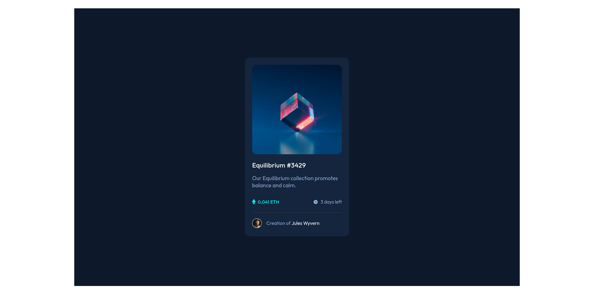

# Frontend Mentor - NFT preview card component solution

This is a solution to the [NFT preview card component challenge on Frontend Mentor](https://www.frontendmentor.io/challenges/nft-preview-card-component-SbdUL_w0U). Frontend Mentor challenges help you improve your coding skills by building realistic projects.

## Table of contents

- [Overview](#overview)
  - [The challenge](#the-challenge)
  - [Screenshot](#screenshot)
  - [Links](#links)
- [My process](#my-process)
  - [Built with](#built-with)
  - [What I learned](#what-i-learned)
  - [Continued development](#continued-development)
  - [Useful resources](#useful-resources)
- [Author](#author)

## Overview

### The challenge

Users should be able to:

- View the optimal layout depending on their device's screen size
- See hover states for interactive elements

### Screenshot

### Links

- Solution URL: [Frontend Mentor solution](https://www.frontendmentor.io/solutions/nftcard-made-with-flexbox-o-Nv0R8_If)
- Live Site URL: [Github page](https://wanderstweek.github.io/nft-card/)

## My process

### Built with

- HTML5
- CSS
- Flexbox

### What I learned

Last couple of weeks I am studying Flexbox, so this was a good practice.
One other interesting thing that i learned was how to put that hover icon over the main image.

### Continued development

I will continue to take HTML & CSS challenges from FrontendMentor.

### Useful resources

- [w3schools](https://www.w3schools.com) - This is my main tutorial website that I use for quick reminders.
- [MDN Web Docs](https://developer.mozilla.org/en-US/) - This place I visit when I need to learn something new, because they explain things in detail.

## Author

- Frontend Mentor - [@wanderstweek](https://www.frontendmentor.io/profile/wanderstweek)
